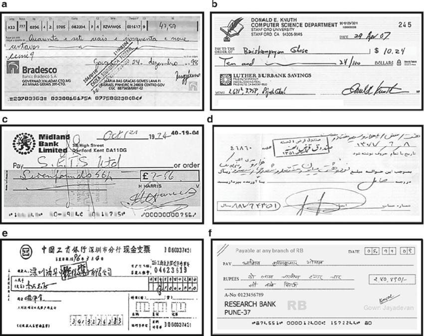

# Handwritten Digit Classification (MNIST)

By: @dineshUmasankar

## Introduction

In our digital age, handwritten documents still hold a significant place in our lives. Our daily lives are filled with handwritten letters, legal documents, shopping lists and mathematical equations.

Through the marvels of optical character recognition (OCR), handwritten content has become seamless to convert into various electronic formats. With a simple picture of from our notebook, many of our phones are able to convert our notes into a text file. As our world becomes increasingly connected, the demand for rapid and accurate analysis of physical documents have increased. For Instance, millions of transactions via check are automatically processed via OCR to ensure their accuracy.

Within this project, we explore the seminal paper: "Gradient-Based Learning Applied to Document Recognition", in order to apply various classification methods to recognize handwritten digits \cite{Lecun1998}.

| | 
|:--:| 
| *Reprinted from \cite{BankCheckImage} under fair use and education.* |

## Background Context

"Real-life document recognition systems are composed of multiple modules including field extraction, segmentation, recognition, and language modeling" [@Lecun1998]. Our project will focus mainly on the recognition part of the process. Within the realm of recognition, specifically handwriting recognition (HWR), there are two methods: online and offline.

| | 
|:--:| 
| *Showcasing offline vs online methodologies of HWR* [@Jayadevan2011] |

1. **Online methods** - "Online methods involve a digital pen/stylus and have access to the stroke information, pen location while text is being written as shown in the figure. Since they tend to have a lot of information in regard to the flow of text being written they can be classified at a pretty high accuracy and the demarcation between different characters in the text becomes much more clear" [@Matcha_2022].

1. **Offline methods** - Offline methods involve recognizing text once it's written down and thus won't have information to the strokes/directions involved during writing, however, it will also have the addition of some background noise such as paper and shadows. [@Matcha_2022].

This project will focus on following the applications mentioned in the seminal paper, where we will build an identification/recognition module to read a bank check. All the processes within document recognition must occur to read a bank check's various components: date, payee, amount (in word form), amount (in numeric form), and signature. Due to time constraints, we will focus only building the module to classify the handwritten digits within the amount specified field of a check, and leave the rest of the implementation to our readers as our approach can be extended to the other fields as well.

## Problem Statement

> [!NOTE]
> *This problem statement is slightly different from the original project submission due to my own personal interests changing, but the subject area and solution application remain the same. The focus has shifted from online HWR method from a pen computer into an offline HWR method.*

**As a user of a bank, I would like to send a picture of my check in order to process the transaction.**

Within this scenario, our hypothetical bank already has the multiple module system running, except they require a handwritten digit recognition model in order to extract the amount that needs to be transacted between both parties.

As the user will be sending a picture, the project primarily focuses on handwriting recognition via the offline method, and will try to optimize with that in mind.

### Objective

Build out an identification / recognition module for the amount (in numeric form) field from a check to classify handwritten digits in the context of a bank check reader application within a hypothetical bank.

### Motivation

There are numerous physical forms and papers, and building out the digit classification system could further digital transformation of existing businesses and industries. By digitizing, it opens up a whole new array of possibilities to analyze at depth for any company, such as being able to feed the information into a Retrieval-Augmented Generation (RAG) model to extract key insights. Furthermore, it would be the first stepping stone to build a generalized OCR system that can be applied regardless of context.

### Significance

The significance of this project is to showcase the ability to convert physical documents into electronic format(s), which would increase one's capability to search and retrieve, and possibly generate new content, especially in our modern day of generative artificial intelligence. The principle(s) of this project can be applied into any application-specific or industry-specific instance to provide key insights or accelerate existing processes.

### Related Work

